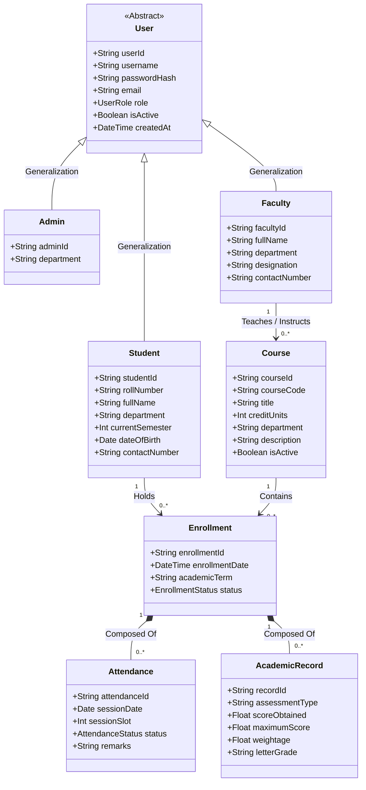

# Conceptual Domain Model

## 1. Domain Model Overview
The conceptual domain model represents real-world entities, their meaningful attributes, and the structural associations governing the Student Information System.

---

## 2. Visual Domain Model (Mermaid Notation)

---

## 3. Domain Multiplicities and Invariants
- Every `Student` can have $0..*$ `Enrollment` records.
- Every `Course` can have $0..*$ `Enrollment` records.
- Each `Enrollment` links exactly $1$ `Student` and $1$ `Course`.
- Each `Enrollment` contains $0..*$ `Attendance` entries and $0..*$ `AcademicRecord` entries.
- Each `Faculty` member instructs $0..*$ `Course` offerings; each `Course` offering has $1$ assigned `Faculty` member.\n